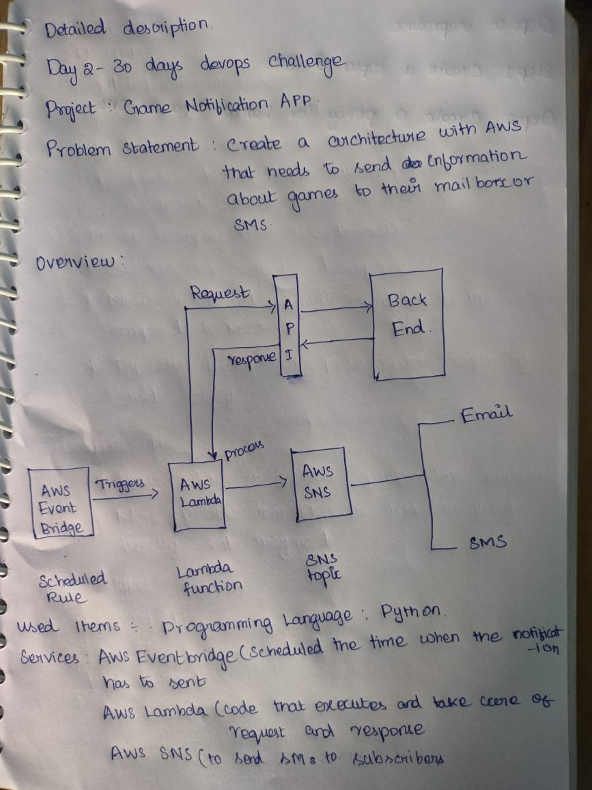

# Project: Game Notification System

## Problem Statement:Create an architecture using AWS to send game update notifications to subscribers.

## Used Tools:

- **Programming Language:** Python (boto3, error handling)
- **AWS Cloud:**
  - 🌐 **AWS EventBridge** (For scheduling events)
  - ⚙️ **AWS Lambda** (Code execution for handling API requests and responses)
  - 📲 **AWS SNS** (For sending notifications)

## Prerequisites:

- AWS account
- SportsData.io account
- Basic understanding of Cloud computing
- Familiarity with API fundamentals
- Python programming knowledge

## Steps to Reproduce:

### 1. Create an SNS Topic

- Open the AWS Management Console.
- Navigate to the **SNS** service.
- Click **Create Topic** and select **Standard** as the topic type.
- Name the topic and note the ARN.
- Click **Create Topic**.

### 2. Add Subscriptions to the SNS Topic

- After creating the topic, click on the topic name in the list.
- Navigate to the **Subscriptions** tab and click **Create Subscription**.
- Select a protocol:
  - 📧 **Email:** Choose **Email** and enter a valid email address.
  - 📱 **SMS (phone number):** Choose **SMS** and enter a valid phone number in international format (e.g., `+1234567890`).
- Click **Create Subscription**.
  - If you added an **Email** subscription, check the inbox of the provided email address. Confirm the subscription by clicking the confirmation link.
  - For **SMS**, the subscription will be immediately active after creation.

### 3. Create the SNS Publish Policy

- Open the **IAM** service in the AWS Management Console.
- Navigate to **Policies** → **Create Policy**.
- Click **JSON** and paste the JSON policy from the `gd_sns_policy.json` file.
- Replace `REGION` and `ACCOUNT_ID` with your AWS region and account ID.
- Click **Next: Tags** (you can skip adding tags).
- Click **Next: Review**.
- Enter a name for the policy.
- Review and click **Create Policy**.

### 4. Create an IAM Role for Lambda

- Open the **IAM** service in the AWS Management Console.
- Click **Roles** → **Create Role**.
- Select **AWS Service** and choose **Lambda**.
- Attach the following policies:
  - **SNS Publish Policy** 
  - **Lambda Basic Execution Role** (AWS managed policy).
- Click **Next: Tags** (you can skip adding tags).
- Click **Next: Review**.
- Enter a name for the role 
- Review and click **Create Role**.
- Copy and save the ARN of the role for use in the Lambda function.

### 5. Deploy the Lambda Function

- Open the **Lambda** service in the AWS Management Console.
- Click **Create Function**.
- Select **Author from Scratch**.
- Enter a function name.
- Choose **Python 3.x** as the runtime.
- Assign the IAM role  to the function.
- Under the **Function Code** section:
  - Copy the content of the `src/gd_notifications.py` file from the repository.
  - Paste it into the inline code editor.
- Under the **Environment Variables** section, add the following:
  - `NBA_API_KEY`: Your NBA API key.
  - `SNS_TOPIC_ARN`: The ARN of the SNS topic created earlier.
- Click **Create Function**.

### 6. Set Up Automation with EventBridge

- Navigate to the **EventBridge** service in the AWS Management Console.
- Go to **Rules** → **Create Rule**.
- Select **Event Source: Schedule**.
- Set the cron schedule for when you want updates (e.g., hourly).
- Under **Targets**, select the Lambda function and save the rule.

### 7. Test the System

- Open the Lambda function in the AWS Management Console.
- Create a **test event** to simulate execution.
- Run the function and check **CloudWatch Logs** for errors.
- Verify that SMS notifications are sent to the subscribed users.

---

This guide walks you through creating and configuring a notification system using AWS services such as SNS, Lambda, and EventBridge. Enjoy keeping your users updated with live game notifications!
